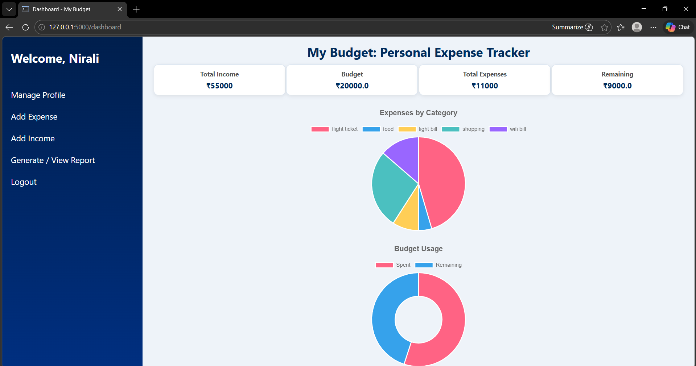
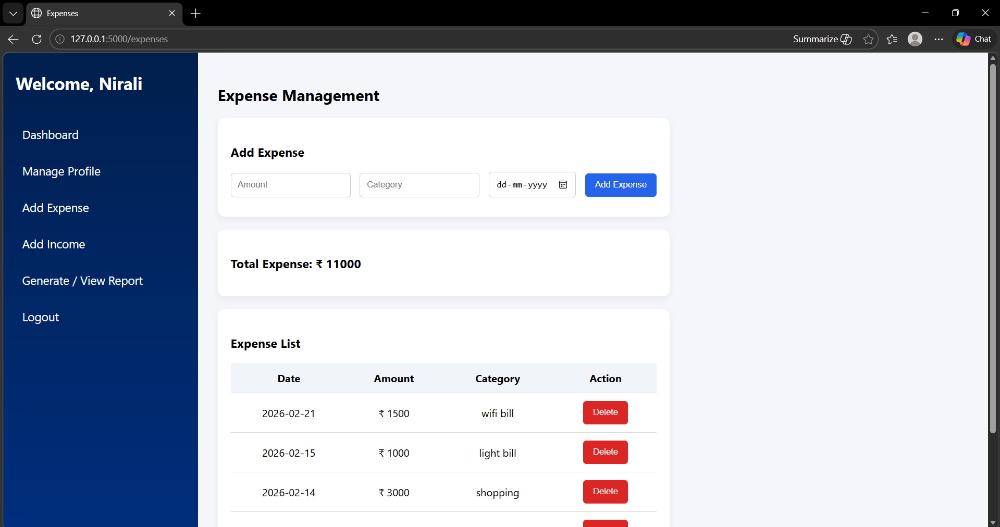
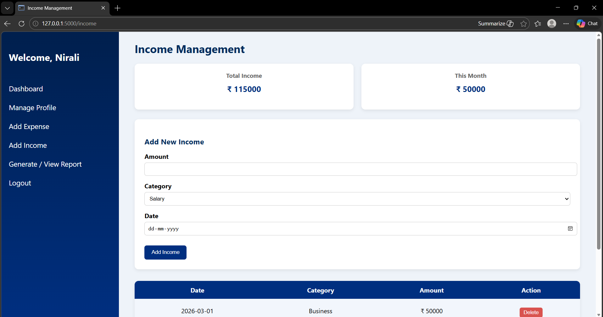
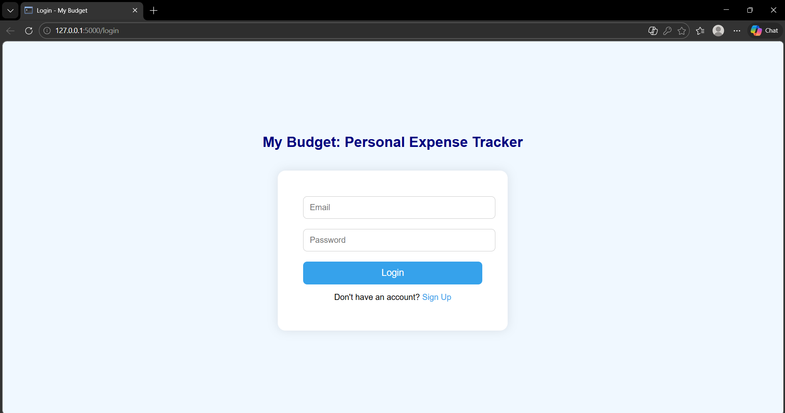

# MY-BUDGET – Personal Finance Analytics & Reporting System

MY-BUDGET is a full-stack web application designed to help users manage personal finances through structured tracking, interactive analytics, and dynamic reporting. The system enables users to monitor income, control expenses, and gain actionable insights into their financial behavior.

## Overview

Managing finances effectively requires more than recording transactions. MY-BUDGET provides a centralized platform that transforms financial data into meaningful insights. Users can track income and expenses, analyze spending patterns, monitor budget utilization, and generate reports for better decision-making.

This project demonstrates how financial data can be structured, processed, and visualized to support real-world analytical use cases.

## Key Features

* User Authentication (Signup & Login)
* Profile Management with budget customization
* Secure password update functionality
* Income tracking with category-based entries and monthly insights
* Expense management with full CRUD operations
* Interactive dashboard with real-time financial metrics
* Weekly and category-wise analytics
* Date-based expense report generation
* Excel export for external analysis
* Budget vs Expense tracking with remaining balance calculation
* PostgreSQL-based data management

## Data Analytics & Visualization

The application provides an interactive dashboard powered by Chart.js:

* **Pie Chart:** Category-wise expense distribution
* **Doughnut Chart:** Budget utilization (Spent vs Remaining)
* **Line Chart:** Weekly expense trends

These visualizations help users quickly understand financial patterns and identify areas of improvement.

## Business Value

This system simulates real-world financial tools by combining data tracking with analytics and reporting. It highlights the transformation of raw transactional data into actionable insights, enabling better financial planning and decision-making.

The project aligns closely with use cases in data analysis, business intelligence, and financial analytics, making it highly relevant for industry applications.

## Tech Stack

* **Frontend:** HTML, CSS, JavaScript
* **Backend:** Python (Flask)
* **Database:** PostgreSQL
* **Visualization:** Chart.js
* **Reporting:** OpenPyXL (Excel export)

## Core Functionalities

* Session-based user authentication and access control
* Structured financial data storage and retrieval
* Aggregation queries for totals and summaries
* Time-based filtering for reports
* Dynamic chart rendering for analytics
* Exportable reports for offline analysis

## Future Enhancements

* Predictive expense analysis
* Budget alerts and notifications
* Mobile-responsive UI improvements
* Multi-user and role-based access
* Integration with external financial APIs

## Application Preview

## Author

**Nirali Sharma**

⭐ This project showcases practical implementation of full-stack development combined with financial data analysis and reporting capabilities.
